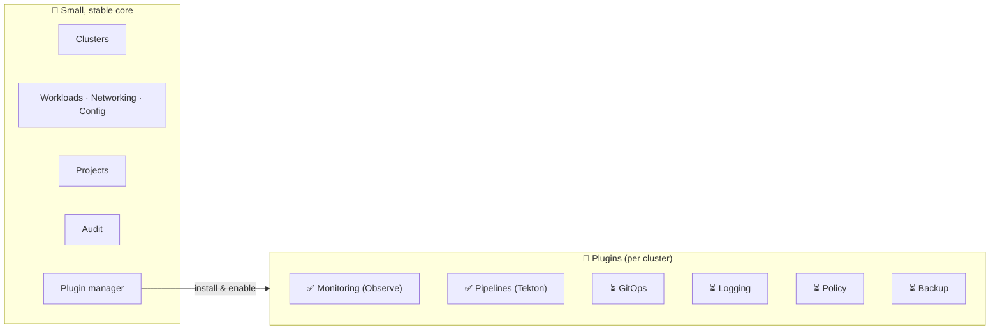
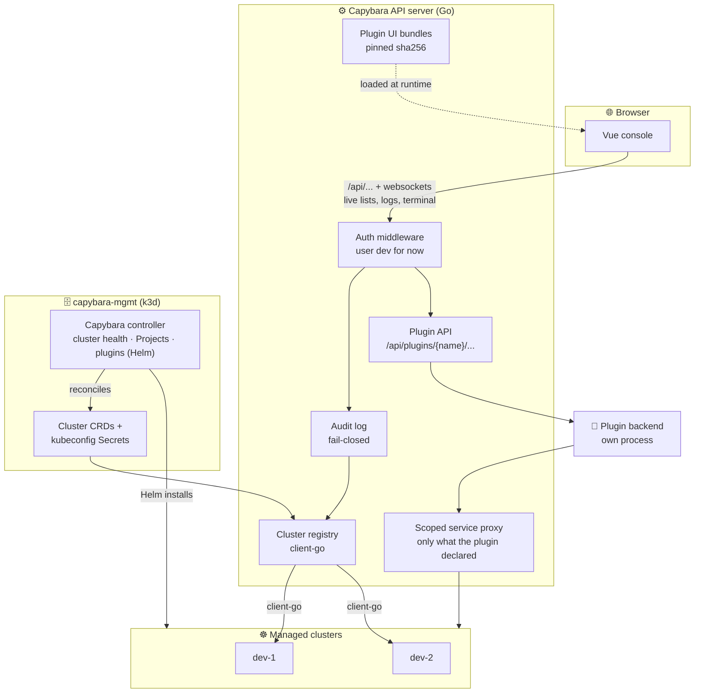
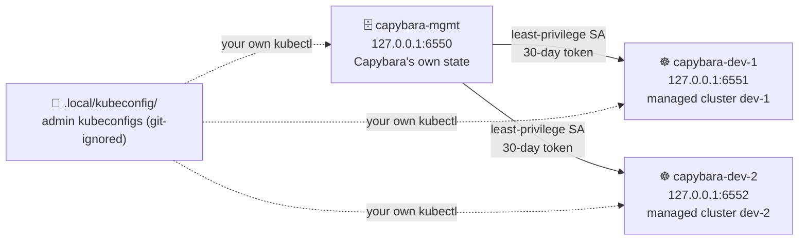
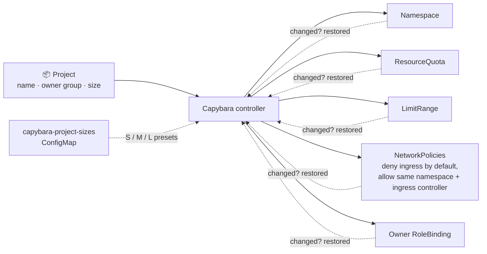
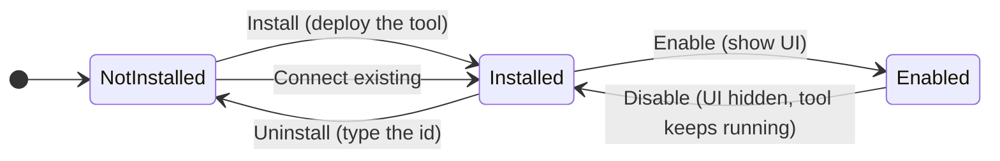
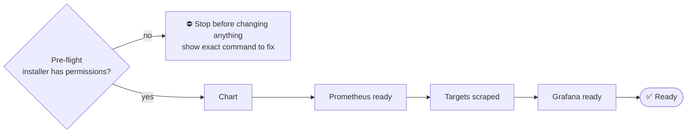
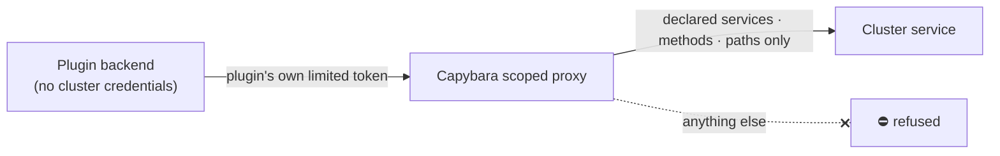
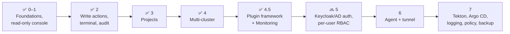

<div align="center">


# Capybara

**A multi-cluster Kubernetes management platform**

In the spirit of Rancher and KubeSphere, with ideas from OpenShift.


[What you can do](#-what-you-can-do) •
[Architecture](#-how-it-fits-together) •
[Getting started](#-getting-started) •
[Console](#-using-the-console) •
[Plugins](#-plugins) •
[Development](#-development) •
[Roadmap](#-roadmap)

</div>

---

Capybara is a multi-cluster Kubernetes management platform, in the spirit of
Rancher and KubeSphere, with ideas from OpenShift: Projects with namespace
templates and an OpenShift-style console for administrators and developers.

It has a **small, stable core** and puts everything else in **plugins**:

- **Core:** clusters, workloads, networking, config, Projects, audit, and the
  plugin manager.
- **Plugins:** monitoring and pipelines (Tekton) today; GitOps, logging,
  policy and backup later. Each is installed and enabled per cluster.



> [!WARNING]
> **Status:** a local development platform (phases 0–4.5 of the
> [roadmap](CLAUDE.md#roadmap)). There is **no authentication yet**: every
> request runs as the user `dev`, and the server listens on `127.0.0.1` only.
> Capybara talks only to the local k3d clusters it creates.

---

## ✨ What you can do

| Area | What it does |
|---|---|
| **Clusters** | Register clusters by kubeconfig (validated, never returned by the API), see health (Connected, Unreachable, AuthFailed, credentials expiring), rotate credentials, remove them. The top bar switches clusters and marks `prod` in red. |
| **Workloads, networking, config** | Live lists and detail pages for Pods, Deployments, Services, ConfigMaps, Secrets, Namespaces and Nodes, kept up to date over websockets. |
| **Write actions** | Edit YAML (server-side apply with conflict detection), scale, restart, delete with type-the-name for risky kinds, and a web terminal into containers. |
| **Projects** | A Project gives a team a namespace with quota (S/M/L), limits, default-deny network policies and an owner RoleBinding, all restored if someone removes them. |
| **Secrets** | Lists never carry Secret values. Values reach the browser only when you press *Reveal*, and that is audited. |
| **Audit** | Every write is recorded before it runs (refused if it can't be recorded), with who, what, where and the result. |
| **Marketplace** | Install plugins per cluster, or connect them to a tool that already runs there. Enable or disable their UI per cluster. |
| **Observe (monitoring plugin)** | Prometheus and Grafana: a Metrics tab on Pods, Deployments and Nodes, cluster and Project usage cards, alerts, and a Grafana link. |
| **Pipelines (Tekton plugin)** | PipelineRuns, TaskRuns and Pipelines with live status and step logs, Rerun and Cancel (audited), and the latest runs on each Project. |

---

## 🏗️ How it fits together



<details>
<summary>Original ASCII diagram</summary>

```
 Browser (Vue console)
    │  /api/...   (+ websockets for live lists, logs, terminal)
    ▼
 Capybara API server (Go) ──────────────┐
    │ auth middleware (user "dev" for now) │ plugin UI bundles (pinned sha256)
    │ audit log (fail-closed)               │ /api/plugins/<name>/... ──▶ plugin backend (own process)
    ▼                                       │                              │
 cluster registry ── client-go ──▶ managed clusters (dev-1, dev-2)          │
    ▲                                       ▲                              │
    │ Cluster CRDs + kubeconfig Secrets     └── scoped service proxy ◀─────┘
    │                                           (only what the plugin declared)
 capybara-mgmt (k3d) ◀── Capybara controller: cluster health, Projects, plugins (Helm)
```

</details>

- **capybara-mgmt** holds Capybara's state as Kubernetes resources
  (`platform.capybara.io`): `Cluster`, `Project`, `PluginRepository`,
  `Plugin`, `PluginInstallation`. Cluster credentials live there as Secrets
  of Capybara's own types.
- **The API server** serves the console and talks to each cluster with that
  cluster's least-privilege ServiceAccount.
- **The controller** checks cluster health, reconciles Projects, and installs
  plugins with a separate, optional *installer* credential that only it can
  read.
- **Plugins** have up to three parts: a Helm chart (the tool), a backend (its
  own process, reached only through Capybara), and a UI bundle loaded at
  runtime into the console's extension points.

More detail: [docs/architecture.md](docs/architecture.md) and the decision
records in [docs/decisions/](docs/decisions/).

---

## 📁 Repository layout

| Path | Contents |
|---|---|
| `cmd/server` | API server (HTTP + websockets) |
| `cmd/controller` | Controllers: cluster health, Projects, plugin catalog and installations |
| `cmd/bootstrap`, `cmd/plugin-chart`, `cmd/plugin-images`, `cmd/plugin-rbac` | Helper tools used by scripts |
| `api/v1alpha1` | CRD types (`platform.capybara.io`) |
| `pkg/cluster` | Cluster registry, kubeconfig validation, health, cluster API |
| `pkg/proxy`, `pkg/stream` | Read-only Kubernetes passthrough; watch, logs and terminal websockets |
| `pkg/action`, `pkg/resource` | Write actions (apply, scale, restart, delete, reveal) and aggregated views |
| `pkg/project` | Project API and controller, size presets |
| `pkg/plugin` | Plugin catalog, installer (Helm), pre-flight, API, bundle serving, proxies |
| `pkg/audit`, `pkg/auth`, `pkg/config` | Audit log, placeholder auth, settings |
| `web/` | Vue 3 + TypeScript console; `web/src/extensions` is the extension registry |
| `sdk/` | `@capybara/sdk`: the extension API for plugin UIs |
| `plugins/monitoring/` | First plugin (Observe): `plugin.yaml`, `chart/`, `backend/`, `ui/` |
| `plugins/tekton/` | Pipelines plugin: `plugin.yaml`, `upstream/` (vendored release), generated `chart/`, `ui/` |
| `plugins/_ui-build/` | Shared build config and checks for plugin UI bundles |
| `deploy/` | k3d scripts, CRDs, size presets, sample workloads |
| `hack/` | Developer scripts (`dev.sh`, `capybara-sa.sh`, `plugin-images.sh`, `plugin-ui.sh`) |
| `docs/` | Architecture and decision records |
| `tools/` | Pinned Go tools (golangci-lint, controller-gen, setup-envtest) |

---

## 🚀 Getting started

### Requirements

- Docker (running), [k3d](https://k3d.io), kubectl
- Go 1.27+
- Node 26.8.1 (exactly, for `make lint` and plugin builds; see `plugins/*/ui/.nvmrc`)

### 1. Create the local clusters

```sh
make cluster-up
```

This creates three k3d clusters and registers two of them in Capybara:

| k3d cluster | API | Role |
|---|---|---|
| `capybara-mgmt` | `127.0.0.1:6550` | Capybara's own state (CRDs, cluster credentials) |
| `capybara-dev-1` | `127.0.0.1:6551` | managed cluster `dev-1` |
| `capybara-dev-2` | `127.0.0.1:6552` | managed cluster `dev-2` |



dev-1 and dev-2 are registered with least-privilege ServiceAccounts
(30-day tokens), not cluster-admin. Admin kubeconfigs for your own `kubectl`
use go to `.local/kubeconfig/` (git-ignored). Nothing touches `~/.kube/config`
or your current kubectl context.

> [!TIP]
> Re-run `make cluster-up` any time, for example after Docker restarts; it is
> safe to repeat.

### 2. Optional: deploy the demo workload

```sh
make demo        # namespace capybara-demo in dev-1 and dev-2
```

### 3. Run Capybara

```sh
make dev
```

This starts the API server (`127.0.0.1:8080`), the controller, the
Monitoring plugin backend and the console. Open
**http://127.0.0.1:5173**. Ctrl-C stops everything.

---

## 🖥️ Using the console

### Clusters

- **Switch clusters** with the selector in the top bar. Every URL carries
  the cluster (`/c/dev-1/...`). A `prod` cluster gets a red tag and a red
  line under the top bar.
- **Add a cluster:** *Clusters → Add cluster*, paste or choose a kubeconfig,
  then *Parse* and *Test connection*. The test shows who you connect as and
  which permissions you have, and warns if the credential is cluster-admin.
  Kubeconfigs that would run commands on the server (exec plugins), use
  file paths, or point outside the local machine are refused.
- **Make a least-privilege kubeconfig** for a cluster:
  ```sh
  make sa-kubeconfig CLUSTER=dev-2              # no access to Secret values
  make sa-kubeconfig CLUSTER=dev-2 WITH_SECRETS=1
  ```
- **Rotate credentials:** cluster page → *Replace kubeconfig*. Open live
  views reconnect with the new credentials.
- **Remove a cluster:** cluster page → *Remove* (type the id). This is
  refused while Projects or plugins use the cluster, unless you choose to
  abandon them; abandoning leaves them running, unmanaged.

### Workloads and resources

- The sidebar's **Workloads**, **Networking**, **Config** and
  **Administration** sections list resources live. Filter by namespace or
  Project in the top bar.
- On a detail page you'll find tabs (Overview, YAML, Events, Logs,
  Terminal, plus plugin tabs such as Metrics) and an **Actions** menu (Edit
  YAML, Scale, Restart, Delete).
- **Secrets** show only names, types and key names; values appear only after
  *Reveal values*.
- Protected namespaces (`kube-system`, `default`, `openshift-*`,
  `capybara-system`, …) can never be deleted from Capybara.

### Projects

*Projects → Create Project*: choose a name, an owner group and a size.

| Size | CPU (requests / limits) | Memory (requests / limits) | Pods |
|---|---|---|---|
| S | 1 / 2 | 2Gi / 4Gi | 10 |
| M | 4 / 8 | 8Gi / 16Gi | 30 |
| L | 8 / 16 | 16Gi / 32Gi | 60 |



The controller creates the namespace, ResourceQuota, LimitRange, network
policies (deny ingress by default, allow the same namespace and the ingress
controller) and an owner RoleBinding, and restores them if they change.
Presets live in the `capybara-project-sizes` ConfigMap in capybara-mgmt
(`make project-sizes` loads `deploy/project-sizes.yaml`).

### Audit

*Audit* lists every write action: who, cluster, object, action and result
(success, failure, denied, conflict). Plugin installs, Helm operations and
credential changes are recorded too.

---

## 🧩 Plugins

Plugins are installed **per cluster** from the **Marketplace**. Two steps
are separate:

- **Install** deploys the tool, or **Connect existing** links to a tool
  already running.
- **Enable** shows its UI on that cluster. Disabling hides the UI and
  leaves the tool running.



### Allow plugin installs on a cluster

Capybara's normal account cannot install charts that create CRDs,
ClusterRoles or webhooks. Plugin installs therefore need a separate
**installer credential** per cluster, used only by the controller:

```sh
# Install mode: the permissions the plugin's chart needs (broad)
hack/capybara-sa.sh dev-1 --installer monitoring

# Connect-only: just the plugin's account in the tool's namespace
hack/capybara-sa.sh dev-2 --installer monitoring --connect \
  --set namespace=monitoring --set service=prometheus --set port=9090
```

Upload the generated `.local/kubeconfig/capybara-<id>-installer.yaml` on
the cluster's page under **Plugin installs**. The page then shows
*Enabled*. Add `--duration 1h` for a short-lived token.

### Install Observe (the monitoring plugin)

The Marketplace and sidebar call it **Observe**, as OpenShift's console does;
its id, used in URLs, namespaces and commands, is `monitoring`.

```sh
make plugin-images PLUGIN=monitoring   # once: import its pinned images into the k3d clusters
```

1. *Marketplace → Observe*. Review what the installer needs and what the
   plugin's backend may reach.
2. *Install on a cluster*, then pick the cluster and the mode:
   - **Install** deploys kube-prometheus-stack (a small preset for k3d).
   - **Connect existing** points at a Prometheus Service already in the
     cluster. Try it with `kubectl apply -f deploy/samples/prometheus-connect.yaml`
     on dev-2.
3. Watch the steps: chart → Prometheus ready → targets scraped → Grafana
   ready → **Ready**. If the installer lacks a permission, the install
   stops before changing anything and shows the exact command to fix it.
4. Use it:
   - the **Metrics** tab on Pods, Deployments and Nodes;
   - **Observe** in the sidebar (Overview, Alerts, Grafana);
   - usage cards on Home and on Project pages.



To uninstall, use the installation's *Uninstall* (type the id). You choose
whether to keep the metrics data. The Prometheus Operator CRDs stay unless
you choose to remove them; Capybara then lists any objects of those kinds
that are not from this plugin, so you can confirm before they are deleted.

> [!IMPORTANT]
> **On OpenShift:** never install a second stack. Use Connect existing to
> Thanos Querier. That path is implemented but untested on real OpenShift,
> and it needs the host allowlist that arrives in Phase 5.

### Install Pipelines (the Tekton plugin)

```sh
make plugin-images PLUGIN=tekton          # once: import Tekton's pinned images
hack/capybara-sa.sh dev-1 --installer tekton
```

1. Upload the installer credential on the cluster's page, then
   *Marketplace → Pipelines → Install on a cluster → Install*. Steps:
   chart → API served → controller, webhook, resolvers ready →
   PipelineRuns accepted → **Ready**. It installs Tekton Pipelines v1.17.0
   with only the cluster resolver enabled (no Git, Hub, bundle or HTTP
   fetching yet).
2. Try the sample (needs `make demo`):
   ```sh
   make kubectl CLUSTER=dev-1 ARGS="apply -f deploy/samples/tekton-pipeline.yaml"
   make kubectl CLUSTER=dev-1 ARGS="create -f deploy/samples/tekton-run.yaml"
   ```
3. Use it: **Pipelines** in the sidebar (PipelineRuns, TaskRuns,
   Pipelines); a run's **Tasks** tab with step logs; **Actions → Rerun** or
   **Cancel run**; the **Pipeline runs** card on Project pages.

**Connect existing** works with a Tekton already in the cluster (on
OpenShift: OpenShift Pipelines, never a second install). Its installer
credential only creates Capybara's read and action grant:
`hack/capybara-sa.sh dev-2 --installer tekton --connect`.

> [!NOTE]
> While Pipelines is installed, Capybara's own account on that cluster may
> read Tekton's resources and create and patch PipelineRuns, for Rerun and
> Cancel only. Creating a PipelineRun can run code as any ServiceAccount in
> its namespace, and until Phase 5 every console user can use those
> actions. See [ADR 0007](docs/decisions/0007-phase-4.6-tekton.md).

### Writing a plugin

A plugin is a folder `plugins/<name>/` with:

- **`plugin.yaml`:** name, version, modes, chart, UI bundle (sha256),
  declared permissions per mode, the services its backend may reach, a
  config schema and install steps.
- **`ui/`:** an ES module built with Vite in library mode. It imports `vue`,
  `pinia`, `naive-ui` and `@capybara/sdk` without bundling them (Capybara
  provides one shared copy), and exports `definePlugin({ name, apiVersion,
  register })`.
- **`backend/` (optional):** a separate process. It calls Capybara's scoped
  endpoint with the credential Capybara issues it.

```
plugins/<name>/
├── plugin.yaml   # name, version, modes, chart, UI bundle (sha256), permissions, services, config schema, steps
├── chart/        # Helm chart (the tool)
├── upstream/     # optional: vendored upstream YAML + build.yaml → chart/ (make plugin-chart)
├── images.txt    # every image the chart names, pinned by digest
├── ui/           # ES module (Vite library mode) → definePlugin({ name, apiVersion, minApi, register })
└── backend/      # optional: separate process, calls Capybara's scoped endpoint
```

`plugins/monitoring/` (with a backend) and `plugins/tekton/` (views and
declared actions only) are the references. A UI can register whole kinds
on the console's generic list and detail pages (`api.registerResource`),
and use its log viewer, object links and live lists. Writes go through
actions declared in `plugin.yaml` and run, audited, by Capybara.
`make plugin-ui` rebuilds UI bundles and pins their sha256; `make lint`
checks that every committed bundle and generated chart rebuilds byte for
byte. See [ADR 0006](docs/decisions/0006-phase-4.5-plugins.md) for the trust
model (UI bundles currently run with full console access) and
[ADR 0007](docs/decisions/0007-phase-4.6-tekton.md) for console permissions,
declared actions and extension API versions.

---

## 🛠️ Development

| Command | What it does |
|---|---|
| `make dev` | API server, controller, plugin backends and console |
| `make test` | Go unit tests, envtest controller suites, Vitest |
| `make lint` | golangci-lint, ESLint, vue-tsc, generated-file and bundle checks |
| `make e2e` | Playwright browser tests against the real k3d clusters |
| `make generate` | Regenerate CRDs and deepcopy code from `api/` |
| `make crds` | Install the CRDs into capybara-mgmt |
| `make kubectl CLUSTER=dev-1 ARGS="get pods -A"` | kubectl against one local cluster |
| `make demo` / `make demo-clean` | Deploy or remove the demo workload |
| `make cluster-down` | Delete the k3d clusters and their kubeconfigs |
| `make help` | All targets |

Settings are flags or `CAPYBARA_*` environment variables
(`pkg/config/config.go`). For example, `CAPYBARA_CLUSTER_CHECK_INTERVAL=5s`,
or `CAPYBARA_PLUGIN_DEV_DIR=plugins` to serve unpinned plugin UI bundles
while developing a plugin (loopback only).

---

## 🔒 Security notes

- Cluster kubeconfigs and installer credentials are stored in capybara-mgmt
  under Capybara's own Secret types. No API returns them, and Reveal, Edit
  and Delete refuse those Secrets on every cluster.
- Capybara's per-cluster account is not cluster-admin. Access to Secret
  values is opt-in (`WITH_SECRETS=1`).
- Plugin backends never get cluster credentials. Capybara proxies only the
  services, methods and paths a plugin declared, with that plugin's own
  limited token.
- Never commit kubeconfigs or tokens. Everything credential-like is written
  under `.local/`, which is git-ignored.



---

## 🗺️ Roadmap

| Phase | Scope | Status |
|---|---|---|
| 0–1 | Foundations, read-only console | ✅ done |
| 2 | Write actions, terminal, audit | ✅ done |
| 3 | Projects | ✅ done |
| 4 | Multi-cluster | ✅ done |
| 4.5 | Plugin framework and Monitoring | ✅ done |
| 5 | Keycloak/AD auth, per-user RBAC, plugin install rights | next |
| 6 | Agent and tunnel instead of stored kubeconfigs | |
| 7 | More plugins: Tekton, Argo CD, logging, policy, backup | |



The product brief is in [CLAUDE.md](CLAUDE.md).